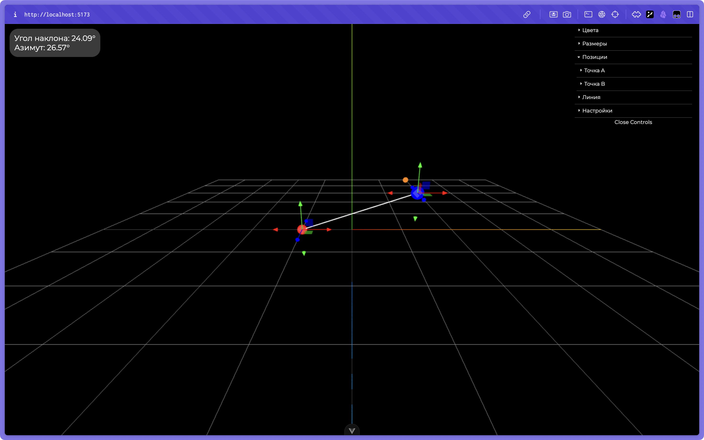

<h1>3D визуализация</h1>

## Описание задания

- Отрезок AB в 3D пространстве x y z.
- Известны координаты точек A и B.
- Необходимо найти угол наклона отрезка AB к плоскости xy и азимут.
- Для визуализации использовать фреймворк ThreeJS.
- Перемещение точек отрезка AB реализовать через инструмент transform controls ThreeJS.
- Вывод расчетного угла и азимута реализовать любым удобным способом.
- Проект оформить в репозиторий github,
- В репозитории должен присутствовать readme с инструкция по запуску проекта и комментарии автора.

## Вид проекта



## Посмотреть проект без установки

[Ссылка на сайт](https://geometrythreejs.vercel.app/)

## Рекомендуемая настройка IDE

[VSCode](https://code.visualstudio.com/) + [Volar](https://marketplace.visualstudio.com/items?itemName=Vue.volar) (и отключить Vetur).

## Поддержка типов для импорта `.vue` в TS

TypeScript не может обрабатывать информацию о типах для импорта `.vue` по умолчанию, поэтому мы заменяем `tsc` CLI на `vue-tsc` для проверки типов. В редакторах нам нужен [Volar](https://marketplace.visualstudio.com/items?itemName=Vue.volar), чтобы сделать службу языка TypeScript осведомленной о типах `.vue`.

## Настройка конфигурации

Смотрите [Vite Configuration Reference](https://vite.dev/config/).

## Установка

1. Склонируйте репозиторий:

   ```bash
   git clone https://github.com/nikgritenok/geometrythreejs.git
   ```

2. Установите зависимости:

   ```bash
   yarn install
   ```

3. Запустите приложение:

   ```bash
   yarn dev
   ```

4. Откройте приложение в браузере по адресу [http://localhost:5173](http://localhost:5173).
